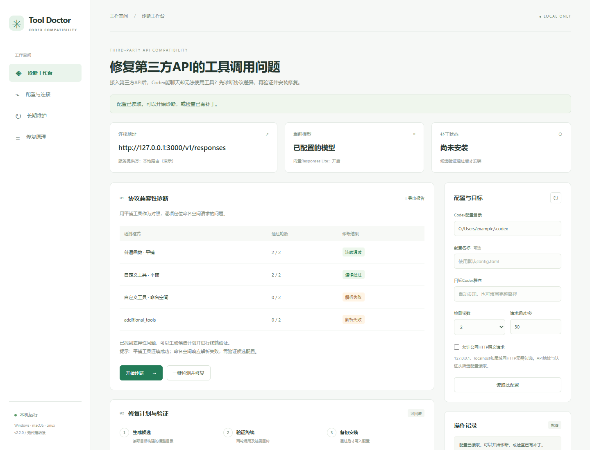

# Codex Tool Doctor

**修复第三方API不兼容导致Codex无法调用工具的问题。**

接入第三方API或本地中转后，Codex能聊天，却不执行终端命令、提示没有工具，或在工具请求阶段报错？Codex Tool Doctor用于诊断这类工具协议兼容问题，并对适用的客户端生成、验证和安装修复配置。

Diagnose and fix Codex tool-calling failures caused by incompatible third-party APIs.

[下载可运行版本](https://github.com/koanydi/codex-tool-doctor/releases/latest) · [使用指南](docs/使用指南.md) · [问题反馈](https://github.com/koanydi/codex-tool-doctor/issues) · [更新记录](CHANGELOG.md)



界面示例，图中检测结果为演示数据。

## 适合解决什么问题

| 现象 | 工具的处理方式 |
| --- | --- |
| 普通聊天正常，终端等工具无法调用 | 比较四种工具格式，判断是否存在协议兼容差异 |
| API拒绝命名空间或additional_tools，或只在这些请求中返回无效响应 | 生成兼容配置，实际验证终端执行与结果回传 |
| 使用`http://127.0.0.1:端口`或HTTPS中转 | 保留端口、路由前缀和认证设置进行诊断 |
| Codex升级后原修复失效 | 检查当前构建，重新生成并验证配置 |
| 连接失败、密钥错误、限流或本机权限阻止 | 报告具体原因，指明应先处理的问题 |

修复针对第三方Responses API与Codex之间的特定兼容问题。API需支持Responses及平铺工具调用，客户端需支持模型目录覆盖。它不将仅支持Chat Completions的接口转换为Responses，也不能给本身不支持工具调用的模型增加工具能力。

## 下载与启动

1. 从[Releases](https://github.com/koanydi/codex-tool-doctor/releases/latest)下载`codex-tool-doctor-v版本号.zip`并完整解压到固定目录。
2. 使用对应平台的入口：

| 系统 | 图形界面 | 命令行菜单 |
| --- | --- | --- |
| Windows | 双击`doctor-gui.cmd` | `.\doctor.cmd menu` |
| macOS | 双击`doctor.command` | `sh doctor.sh menu` |
| Linux | `sh doctor-gui.sh` | `sh doctor.sh menu` |

缺少Node.js或npm时，启动器自动下载并校验便携环境；缺少或损坏的依赖会自动修复，准备好后继续启动。已有环境会复用。首次准备环境需要联网和目录写入权限，不需要管理员权限或sudo。

界面由本机程序运行，在浏览器打开，仅监听`127.0.0.1`。无需注册新账户，也不需要部署服务器。macOS解压后若无法双击，可运行`sh doctor-gui.sh`；Linux桌面没有浏览器时可使用命令行。

## 使用流程

1. **读取配置**：选择Codex配置目录和目标Codex程序。模型、API地址和认证从已有配置读取。
2. **开始诊断**：比较平铺工具与命名空间工具，展示每组结果和阻止原因。
3. **验证并修复**：点击“一键检测并修复”，或先查看计划，再点击“验证并安装”。两轮真实终端验证通过后才备份和写入配置。
4. **重启Codex**：新建会话，再尝试让Codex执行命令。需要跟踪后续升级时，启用“登录后维护”。

诊断和验证使用当前API，会消耗该服务的额度。修复只修改所选配置的模型目录引用，不修改Codex二进制，不转发日常请求。失败会保留原配置；需要恢复时可回滚。

## 本地HTTP与HTTPS

以下地址形式都支持，`/responses`只拼接一次：

```text
http://127.0.0.1:3000
http://localhost:3000/v1
http://127.0.0.1:3000/router/api/v1
https://127.0.0.1:3443/v1
https://api.example.com/v1
```

HTTPS正常校验证书，自建CA可通过`NODE_EXTRA_CA_CERTS`指定。公网HTTP需显式开启“允许公网HTTP明文请求”。配置示例、无密钥路由及请求头设置见[使用指南](docs/使用指南.md)。

## 持久修复与适用边界

修复配置没有到期时间。升级维护可在Codex、模型或配置变化后重建目录；无变化时不发送API请求。未来客户端或服务端协议改变仍可能需要新的适配，不能保证一次修复适用于所有未来版本。

Windows、macOS和Linux共用修复逻辑，自动化检查覆盖三系统。实际能否修复以所选客户端的能力检测和两轮终端验证为准。终端成功不等于所有插件、图像工具和历史会话都已验证。

## 文档与反馈

- [使用指南](docs/使用指南.md)：配置、命令、升级维护、恢复和常见故障。
- [设计说明](docs/设计说明.md)：协议差异、修复条件、事务和跨平台适配。
- [验证指南](docs/验证指南.md)：可复现故障、自动化测试与真实客户端验收。
- [参与开发](CONTRIBUTING.md)：本地开发与提交变更。

反馈时请提供系统、工具版本、Codex版本及诊断结果。请勿上传API密钥、auth.json、完整配置或带认证信息的URL。

本项目是独立社区工具，与OpenAI无隶属关系。

## 仓库维护

本仓库由[koanydi](https://github.com/koanydi)维护。下载及问题反馈入口指向本仓库。
